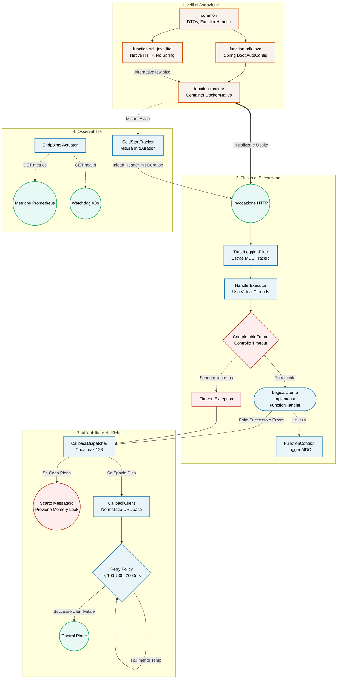

```mermaid
graph TD
    classDef modulo fill:#f9f2ec,stroke:#d35400,stroke-width:2px,color:#000
    classDef core fill:#e8f4f8,stroke:#2980b9,stroke-width:2px,color:#000
    classDef esterno fill:#e8f8f5,stroke:#27ae60,stroke-width:2px,color:#000
    classDef pericolo fill:#fdedec,stroke:#c0392b,stroke-width:2px,color:#000

    subgraph Moduli [1. Livelli di Astrazione]
        C[common<br>DTOs, FunctionHandler]:::modulo
        SDK[function-sdk-java<br>Spring Boot AutoConfig]:::modulo
        LITE[function-sdk-java-lite<br>Native HTTP, No Spring]:::modulo
        RT[function-runtime<br>Container Docker/Nativo]:::modulo

        C --> SDK
        C --> LITE
        SDK --> RT
        LITE -. Alternativa low size .-> RT
    end

    subgraph Flusso [2. Flusso di Esecuzione]
        REQ((Invocazione HTTP)):::esterno
        TLF[TraceLoggingFilter<br>Estrae MDC TraceId]:::core
        HE[HandlerExecutor<br>Usa Virtual Threads]:::core
        TIMEOUT{CompletableFuture<br>Controllo Timeout}:::pericolo
        UF([Logica Utente<br>implementa FunctionHandler]):::core
        CTX[FunctionContext<br>Logger MDC]:::core

        REQ --> TLF
        TLF --> HE
        HE --> TIMEOUT
        TIMEOUT -->|Entro limite| UF
        TIMEOUT -. Scaduto limite ms .-> ERR[TimeoutException]:::pericolo
        UF -. Utilizza .-> CTX
    end

    subgraph Callback [3. Affidabilita e Notifiche]
        CD[CallbackDispatcher<br>Coda max 128]:::core
        DROP((Scarto Messaggio<br>Previene Memory Leak)):::pericolo
        CC[CallbackClient<br>Normalizza URL base]:::core
        RETRY{Retry Policy<br>0, 100, 500, 2000ms}:::core
        CP((Control Plane)):::esterno

        UF -->|Esito Successo o Errore| CD
        ERR --> CD
        CD -->|Se Coda Piena| DROP
        CD -->|Se Spazio Disp| CC
        CC --> RETRY
        RETRY -->|Fallimento Temp| RETRY
        RETRY -->|Successo o Err Fatale| CP
    end

    subgraph Obs [4. Osservabilita]
        CS[ColdStartTracker<br>Misura InitDuration]:::core
        ACT[Endpoints Actuator]:::core
        P((Metriche Prometheus)):::esterno
        W((Watchdog K8s)):::esterno

        CS -->|Inietta Header Init-Duration| REQ
        ACT -. GET metrics .-> P
        ACT -. GET health .-> W
    end

    RT == Inizializza e Ospita ==> REQ
    RT -. Misura Avvio .-> CS
```
